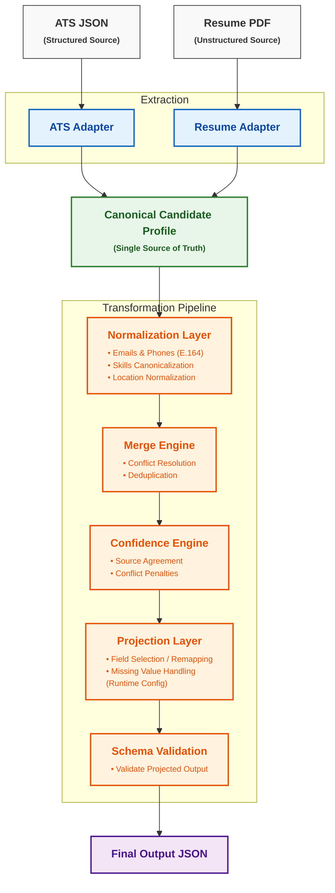

# Multi-Source Candidate Data Transformer

**Live Demo:** [https://candidate-data-transformer-n9ahkjmob9b6r3srjm947g.streamlit.app/](https://candidate-data-transformer-n9ahkjmob9b6r3srjm947g.streamlit.app/)<br>
**Demo Video:** [Watch on Google Drive](https://drive.google.com/file/d/1goU8VCE0aH4i6RNYnFc_1TLyZTdMZ2Wa/view?usp=sharing)

## Project Overview
This pipeline ingests candidate data from heterogeneous sources (structured ATS JSON and unstructured résumé PDFs) and fuses them into a single, authoritative Canonical Candidate Profile. It performs deterministic extraction, data normalization, and conflict resolution via a dedicated Merge Engine. Every field is tracked with precise provenance and scored by a Confidence Engine, before being passed to a runtime Projection Engine that enables configurable output shapes without altering internal architecture.

## Architecture



## Sample Inputs
The pipeline accepts raw inputs. For complete examples, see the `samples/` directory.

**Example ATS JSON snippet:**
```json
{
  "candidateName": "Anurag",
  "primaryEmail": "anurag612@gmail.com",
  "mobile": "+916206478201"
}
```

## Produced Canonical Output
The system generates a rich canonical representation containing merged data, confidence scores, and provenance.

**Example Output snippet:**
```json
{
  "full_name": "Anurag",
  "emails": ["anurag612@gmail.com"],
  "phones": ["+916206478201"],
  "overall_confidence": 0.84
}
```

## Projection Example
The output can be dynamically reshaped at runtime using a JSON configuration.

**Projection Config:**
```json
{
  "fields": [
    {
      "path": "candidate_name",
      "from": "full_name"
    }
  ]
}
```

**Projected Output:**
```json
{
  "candidate_name": "Anurag"
}
```

## How to Run

```bash
# Install dependencies
pip install -r requirements.txt

# Launch the interactive UI
streamlit run app.py
```

## How to Test

```bash
# Run the complete automated test suite
pytest
```

## Assumptions
- The candidate's name appears near the top of the resume.
- The resume follows common formatting conventions (standard headings for Experience, Education, etc.).
- Skills are mapped through a predefined local taxonomy.
- Missing values are explicitly returned as `null` rather than invented/guessed.

## Known Limitations
- Extraction relies on deterministic heuristics and regex.
- No OCR support for scanned images (requires parseable PDF text).
- No fuzzy entity resolution (relies on exact matches or taxonomy).
- No AI/LLM-based extraction components.
